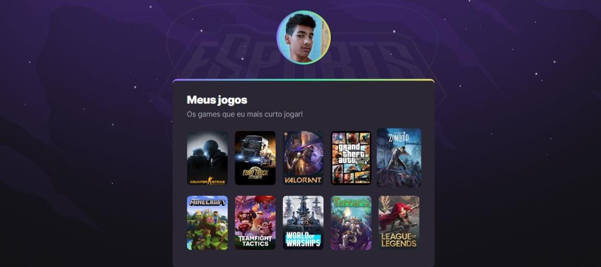

# AivanSocialGame

O projeto AivanSocialGame, foi desenvolvido atrás de um evento criado pela Rocketseat, chamado de NLW eSports, um evento voltado para projeto com a temática de Games

O objetivo do projeto, é trazer quais jogos, youtubers e streamers, que vc acompanha com mais frequência. Trazendo assim uma característica de uma "rede social" voltada para Gamers

## Demonstração

## 💻 Tech Stack:
  
  
 

## Material

https://app.rocketseat.com.br/plus/lesson/nlw-09-e-sports-explorer-stage-01
## Licença

[MIT License](https://choosealicense.com/licenses/mit/)

## Suporte

Para suporte, mande um email para ivan.rocha.0987@gmail.com ou entre em contato via whatsapp (41) 98468-5317.

## Feedback

Se você tiver algum feedback, por favor enviar para ivan.rocha.0987@gmail.com

## Autores

- [@IvanRocha](https://www.github.com/ivanrocha10)
- [@Rocketseat](https://github.com/Rocketseat)

## Projeto

  Acesse o "AivanSocialGame" pelo QR:

  

Caso o QR não funcione, acesse <a href="https://ivanrocha10.github.io/AivanSocialGame/">aqui</a>